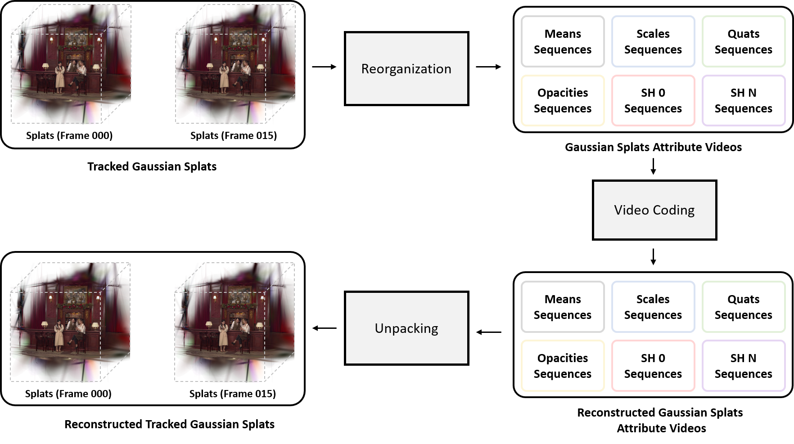

# GSCodec Studio

GSCodec Studio is an open-source framework for Gaussian Splats Compression, including static and dynamic splats representation, reconstruction and compression. It is bulit upon an open-source 3D Gaussian Splatting library [gsplat](https://github.com/nerfstudio-project/gsplat), and extended to support 1) dynamic splats representation, 2) training-time compression simulation, 3) more test-time compression strategies.


## Installation
### Repo. & Environment
Please first clone the repository and cd to the root directory.
```bash
# Make a conda environment
conda create --name gscodec_studio python=3.10
conda activate gscodec_studio
```

### Packages Installation

Please install [Pytorch](https://pytorch.org/get-started/locally/) first. Then, you can install the gsplat library extended with more compression features from source code. In this way it will build the CUDA code during installation.

```bash
pip install .
```

If you want to do further development based on this framework, you use following command to install Python packages in editable mode.
```bash
pip install -e . # (develop)
```

## Examples

**Preparations**

Same as gsplat, we need to install some extra dependencies and download the relevant datasets before the evaluation.

```bash
cd examples
pip install -r requirements.txt
# download mipnerf_360 benchmark data
python datasets/download_dataset.py
```
You can download the Tanks and Temples dataset and Deep Blending dataset used in original 3DGS via [this link](https://repo-sam.inria.fr/fungraph/3d-gaussian-splatting/datasets/input/tandt_db.zip) and place these datasets under 'data' folder.
```bash
# place other dataset, e.g Tanks and Temples dataset, under 'data' folder
ln -s /xxxx/Dataset/tandt data/tandt 
```

We also use third-party library, 'python-fpnge', to accelerate image saving operations during the experiment for now. We also use third-party library, 'gridencoder', to facilitate hash encoding.

```bash
cd ..
pip install third_party/python-fpnge-master
pip install third_party/gridencoder
```

If you are interested in post-training compression, you also need to install library for [vector quantization](https://github.com/DeMoriarty/TorchPQ?tab=readme-ov-file#install) and [plas sorting](https://github.com/fraunhoferhhi/PLAS), before running scripts.
```bash
# refer to https://github.com/DeMoriarty/TorchPQ?tab=readme-ov-file#install to see how to install TorchPQ

# install original implementation of PLAS
pip install git+https://github.com/fraunhoferhhi/PLAS.git
```


### Compress Tracked Gaussian Splats Sequences via Video Codec (Video-based Anchor)
If you're interested in MPEG Gaussian Splats Coding, we have implemented a simple coding method for compressing temporally tracked Gaussian Splats using Video Codec as the core component. The figure shows the pipeline of video-based anchor.

The key idea is 1) to organize the sequence of Gaussian Splats into multiple attribute videos of Gaussian Splats, and 2) to use video codec to compress these attribute videos. If you want to reproduce our latest results, please checkout below **updated version of guidance**.
<details open>
<summary>Updated version of guidance</summary>

**Preparation**

1.Install modified PLAS:

[Original PLAS](https://github.com/fraunhoferhhi/PLAS) can not guarantee the identical sorted results on different types of GPU (e.g. Nvidia RTX 3090 vs. 3080 Ti), even given the exactly same input data, same random seeds. This issue stems from the `torch.randperm` function. We make a workaround on this issue, and upload the modified code to the [repository](https://github.com/JasonLSC/PLAS).

So if you want to reproduce the identical sorted results, please install modified PLAS:
```
# If you have installed original PLAS, you need to uninstall it and install modified version.
pip install git+https://github.com/JasonLSC/PLAS
```

2.Compile video codec:
You can just use our pre-compiled executables under the path `examples/helper/HM-18.0`. 
Or you also can place the source code of [HM-18.0](https://vcgit.hhi.fraunhofer.de/jvet/HM/-/tree/HM-18.0?ref_type=tags) under the path `examples/helper/HM-18.0`. Then you just need to compile it:

```
cd examples/helper/HM-18.0
mkdir build
cd build
cmake .. -DCMAKE_BUILD_TYPE=Release
make -j
```

Note: Since the original code from HM-18.0 fails during compilation due to certain warnings, I added the line `set(CMAKE_CXX_FLAGS "${CMAKE_CXX_FLAGS} -Wno-array-bounds")` in CMakeLists.txt to suppress this issue.

**Scripts**

Go back to the `examples` folder and run the scripts:

```
cd ../../../
bash benchmarks/mpeg152/1f_vid_hm/bartender.sh
```


**Note**: 
Before using the scripts mentioned above, please note the following:
1. Please modify the input parameters ``--ply_dir``, ``--data_dir``, ``--ply_filename``(needed for single frame input), ``--masks``(needed for object-centric content) in the script to match your local paths.
2. These experiments involve third-party programs, including QMIV (quality evaluation software). If you need newer versions, you can compile them yourself and replace the current executables under ``examples/helper``.

**Experimental results collections**

After successfully completing experiment of one scene (where one script corresponds to one scene), you can find the experimental results saved in CSV format in the results folder, e.g. ``examples/results/mpeg152/1f_vid_hm/<scene_name>``. The relevant data can be easily pasted into the MPEG GSC Excel Template.

</details>

<details>
    <summary>Old version of guidance</summary>

You can try this method using the script below.
```bash
cd examples
bash benchmarks/mpeg/video_anchor_bench.sh
```

To compare with the Point Cloud Compression-based approach in MPEG Gaussian Splats Coding group, we have developed a simple wrapper based on their software. This allows us to evaluate both methods using the same evaluation protocol. You can try the Point Cloud Compression-based approach using the script below.
```bash
cd examples
bash benchmarks/mpeg/pcc_anchor_bench.sh
```

***Running the above script will reproduce both our proposed approach from contribution m72063 and the baseline results that we used for comparison.***

**Note**: 
Before using the scripts mentioned above, please note the following:
1. Please modify the input parameters ``--ply_dir``, ``--data_dir``, and ``--result_dir`` in the script to match your local paths.
2. These experiments involve third-party programs, including point cloud codec and QMIV (quality evaluation software). If you need newer versions, you can compile them yourself and replace the current executables under ``examples/helper``.
</details>

### Pre- & Post-Processing of Video-based Anchor
We provide standalone Python scripts to handle preprocessing and postprocessing of Gaussian Splats parameters in [Video-based Anchor](#compress-tracked-gaussian-splats-sequences-via-video-codec-video-based-anchor).

Specifically, the preprocessing includes quaternion normalization and fixed-point quantization for all parameters. In fixed-point quantization, we employ per-channel min-max quantization for all attributes. While the means representing Gaussian Splats positions are uniformly quantized to 16 bits, other attributes use 8-bit uniform quantization. The per-channel maximum and minimum values for each component, along with their bitdepth information, are stored in a JSON file as metadata for subsequent postprocessing.

``` shell
cd examples
python gs_ply_process.py \
    --preprocess \
    --raw_ply_path data/GSC_splats/m71763_bartender_stable/track/frame000.ply \
    --exp_dir results/gs_ply_process/bartender \
```

The postprocessing involves dequantizing the input PLY file using the metadata information. Note that postprocessing cannot be skipped since it converts the values back to the I-3DGS domain.

``` shell
cd examples
# Note: Place the decoded PLY file in the '--exp_dir' directory and provide its filename via the '--quantized_ply_filename' parameter.
python gs_ply_process.py \
    --postprocess \
    --quantized_ply_filename quantized.ply \ 
    --exp_dir results/gs_ply_process/bartender \
    --dequantized_ply_filename dequantized.ply
```

You can check out "examples/benchmarks/gs_ply_process/gs_ply_process.sh" and "examples/gs_ply_process.py" for more details.

### 
---

### Static Gaussian Splats Training and Compression

We provide a script that enables more memory-efficient Gaussian splats while maintaining high visual quality, such as representing the Truck scene with only about 8MB of storage. The script includes 1) the static splats training with compression simulation, 2) the compression of trained static splats, and 3) the metric evaluation of uncompressed and compressed static splats.

```bash
# Tanks and Temples dataset
bash benchmarks/compression/final_exp/mcmc_tt_sim.sh
```

### Dynamic Gaussian Splats Training and Compression

First, please follow the dataset preprocessing instruction described in [this file](mpeg_gsc_utils/multiview_video_preprocess/README.md) for training data prepration.

Next, run the script for dynamic gaussian splats training and compression.
```bash
cd examples
bash benchmarks/dyngs/dyngs.sh
```

### Extract Per-Frame Static Gaussian from Dynamic Splats

If you finsh the training of dynamic splats, then you can use the script to extract static gaussian splats stored at discrte timesteps in ".ply" file
```bash
cd examples
bash benchmarks/dyngs/export_plys.sh
```

### Load .ply File and Render

If you want to directly read and render splats exported as PLY files, you can use the following script.
Note: You need to modify the PLY file path in the scripts.
```bash
cd examples
bash benchmarks/load_ply_and_render.sh
```

## Contributors

This project is developed by the following contributors:

- Sicheng Li: jasonlisicheng@zju.edu.cn
- Chengzhen Wu: chengzhenwu@zju.edu.cn
- Zhiwei Zhu: zhuzhiwei21@zju.edu.cn

If you have any questions about this project, please feel free to contact us.

## Acknowledgement
This project is bulit on [gsplat](https://github.com/nerfstudio-project/gsplat). We thank all contributors from [gsplat](https://github.com/nerfstudio-project/gsplat) for building such a great open-source project.